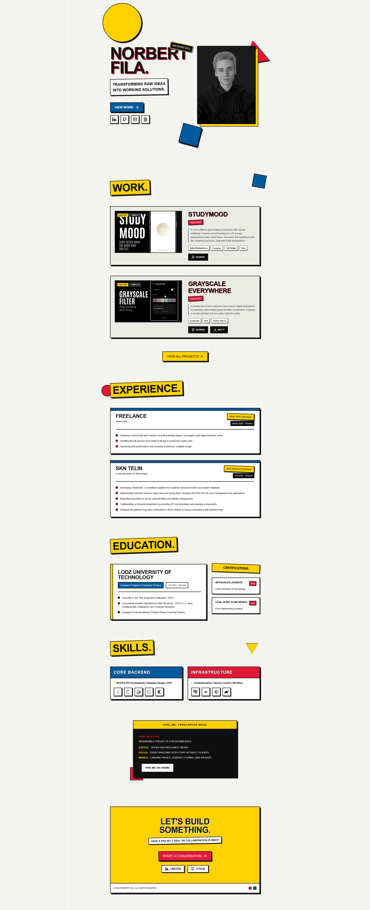

# Norbert Fila - Portfolio 

A personal portfolio presenting my projects, design skills, and approach to creating digital experience.

## 🔗 Live Demo

https://nubet.github.io/portfolio/

## 🎨 Aesthetic Direction

A Bauhaus-inspired portfolio with a neobrutalist character - Based on strong contrast, geometric forms and a bold typography.

Designed to be simple, expressive, and memorable.

## 🛠️ Tech Stack 

- **Framework:** React + Vite
- **Language:** TypeScript
- **Styling:** Pure CSS

## 📸 Screenshots

